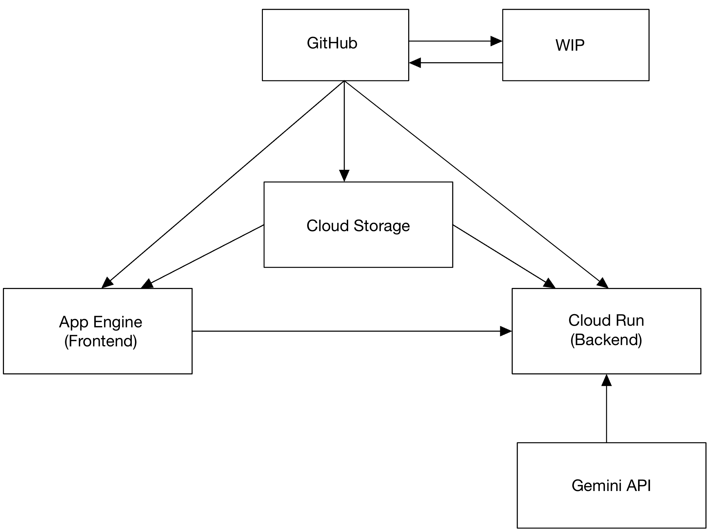

# Pick Perfect

## Repository
https://github.com/HeyKile/pick-perfect?tab=readme-ov-file

## Group Members:

· Kyle Bello

· Ruchi Hegde

· Ayaan Siddiqui

· Lining (Jimmy) Liu

## Project Description:

When gardening, it can be tough to discern exactly when a fruit/vegetable is ready to be picked and eaten. Our project aims to make that easier. Our app’s main functionality is the ability to take an image of a fruit/vegetable and then tell the user whether it’s ripe enough or not. This will utilize cloud technologies and containerization to create an awesome application. Check out the live [website](https://pick-perfect-ui-dot-mineral-cell-433922-k7.ue.r.appspot.com).

## Project Structure:

There is a front-end interface for users to interact with, allowing them to upload photos of their plants to check growth stage. The backend processed the image from the front end, using an AI-powered image processing to determine the growth stage. The response is then sent back to the user, allowing them to take the next steps. We used **Cloud Run, App engine, Gemini AI, Cloud Build API, Cloud Storage Bucket and Artifact Registry** for this project.

---

---

## CI/CD Description
### Frontend
- The frontend code is a simple React application hosted and stored using GCP Services
- To host our frontend, we decided to use GCP App Engine
  - Simplicity: Did not need the tooling Firebase provides (db, auth, etc.)
  - Server management entirely taken care of (Scaling done automatically)
- For storage, we went with Cloud Storage
  - Seemless integration with App Engine
  - Great for storing static files (like our app!)
- For deployment, we utilized a GitHub Actions pipline to update our Cloud Storage Bucket and deploy the latest code to App Engine
  - Utilized a Workload Identity Pool to authenticate GitHub w/ GCP
  - Provided a service account for GitHub to have the proper permissions to update our Cloud Storage and App Engine deployed code
  - Configured Action to run with each Push to main to provide the latest code changes
  - To expand our frontend pipeline, a secondary testing environment would be extremely useful and prevent bad frontend code from entering production

### Backend
The backend is hosted at this url: [https://pick-perfect-api-image-736056241127.us-central1.run.app/api/generate](https://pick-perfect-api-image-736056241127.us-central1.run.app/api/generate)

*Note: The API only accpets requests from our frontend's URL. But it also accepts requests made using [Postman](https://www.postman.com)*

- The backend code is a simple flask applictaion that utilizes Google's Gemini AI 1.5 Flash model to analyze images of vegetation and determine if it is ripe enough to be picked or harvested.
  - We chose Gemini AI for its powerful image recognition capabilities, ensuring accurate ripeness detection, and seamless integration with cloud technologies for a scalable, reliable user experience.
- The API accepts a POST request with the type of the image uploaded and the base64 encryption of the image.
- The API returns a JSON repsonse containing the following information:
  - The plant's name.
  - A booleans expression specifying whether its is ripe or not.
  - A numeric meausre of the model's confidence in its answer.
  - A small text message with reasons for its decision.
- The backend API is hosted using google's Artifact Registry.
  - We used Google Artifact Registry to store the app's Dockerized image because it offers secure, scalable, and easy integration with Google Cloud services, streamlining deployment and management.
- The app is containerized using docker.
  - The docker image is build using Google Cloud Build and stored in the Artifact Registry.
  - The docker image is deployed as a service using Google Cloud Run.
  - We used Google Cloud Build and Cloud Run for their seamless integration, enabling automated builds and efficient deployment of the app.
- Deployment of code was automated using Github Actions pipeline to build and update the latest docker image of the app and deploy it as a Cloud Run service.
  - Provided a service account for GitHub to have the proper permissions to build, push and deploy our code promptly.
  - Configured Action to run with each Push to main to provide the latest code changes.
